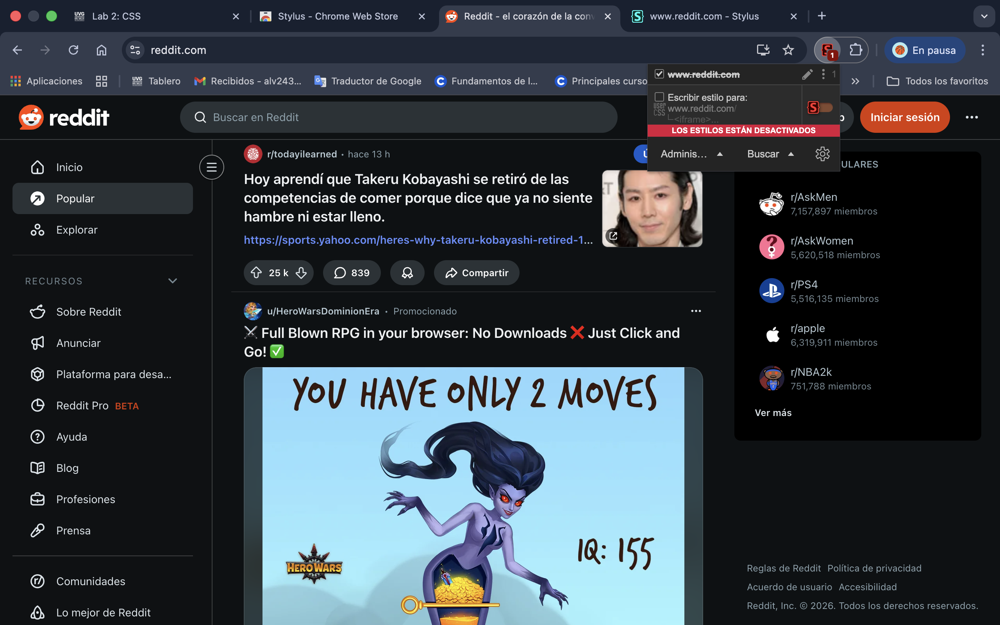
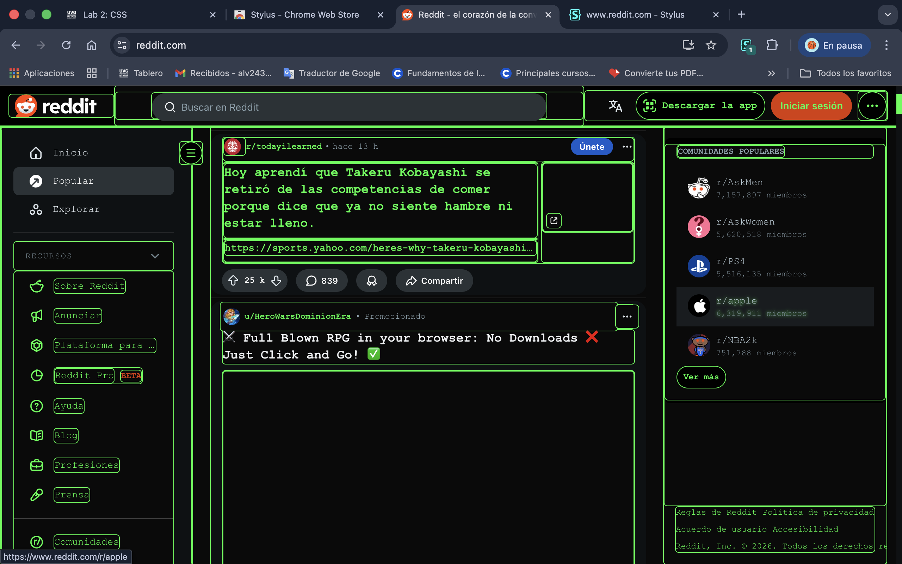

# Lab 2 - CSS Ricing

## Description

This project customizes Reddit using a Cyberpunk / Hacker video game inspired theme.

The objective was to transform the original Reddit interface into a futuristic terminal-style experience with neon green elements, glowing borders, interactive hover effects, and animated headings.

## Before

## After

## Implementation

The customization was created using the Stylus browser extension. 
The CSS modifies colors, typography, buttons, links, scrollbars, and applies animations to create a video game inspired hacker aesthetic.
